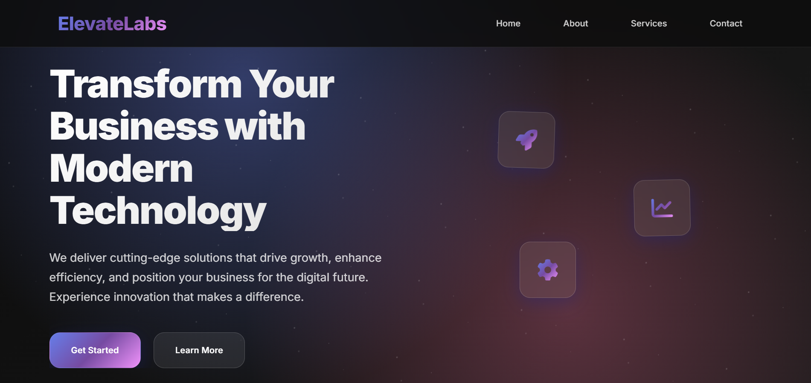
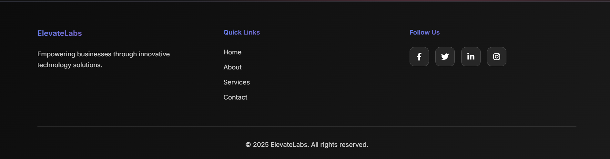

# Responsive Landing Page

A simple, clean landing page built using HTML and CSS featuring a header, hero section, and footer with social links.

---

## Features

- Header with logo and navigation links
- Hero section with heading, description, and call-to-action button
- Footer with social media links
- Modern, minimalistic design

---

## Setup and Usage

1. Clone or download the repository
2. Open the project folder in your code editor
3. Use **Live Server** (or open `index.html` in a browser) to view the page
4. Resize the browser window to explore the layout

---

## Screenshots

### Desktop View

### Mobile View

### Footer

