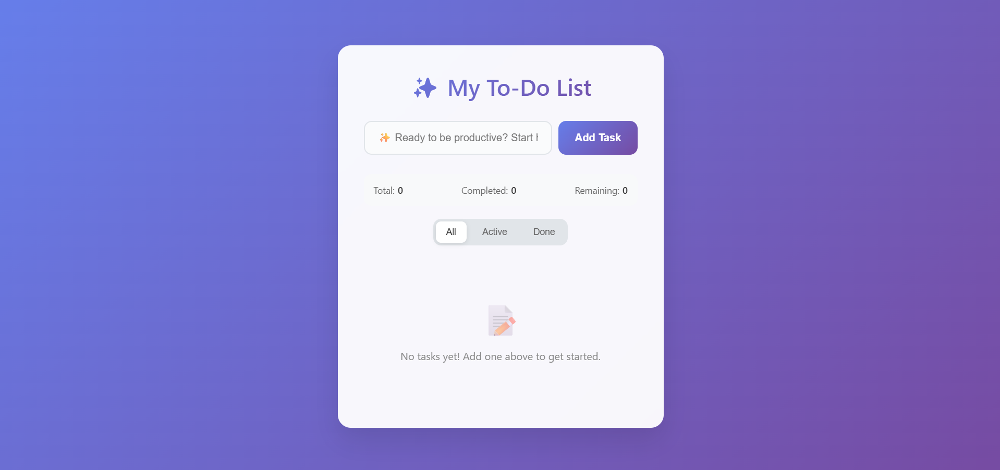
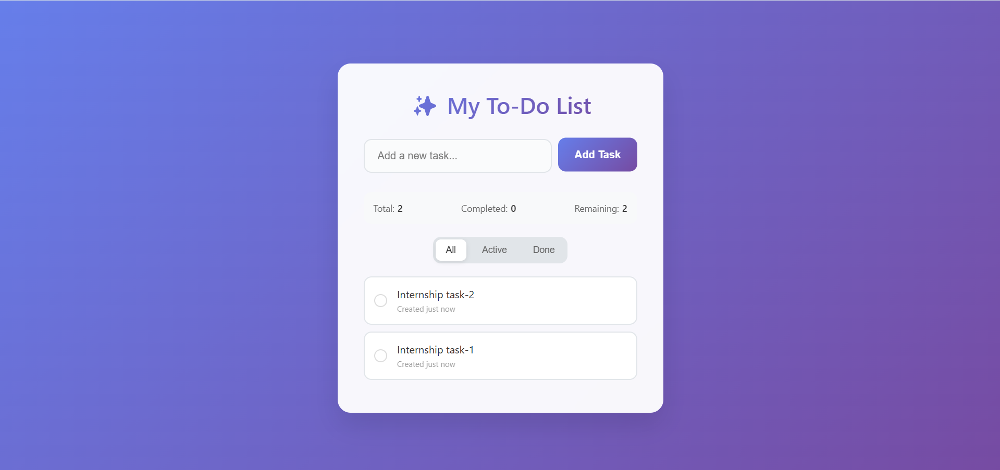
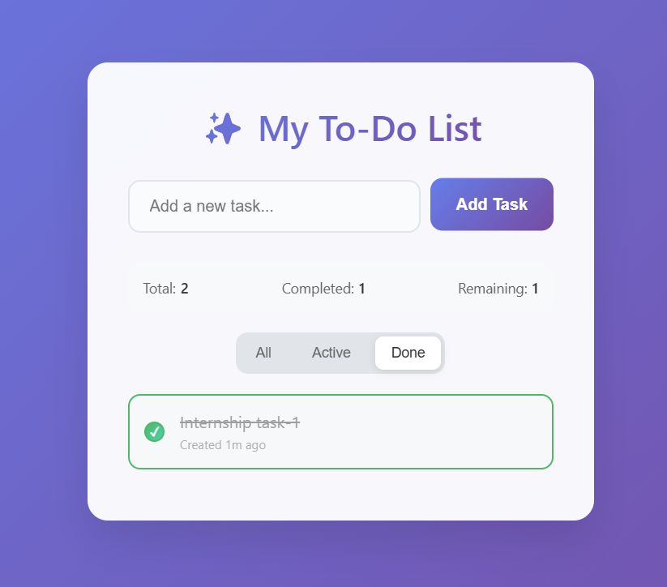
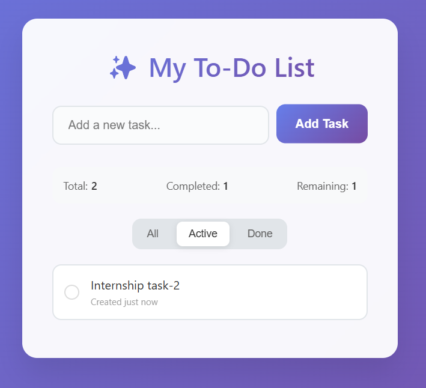
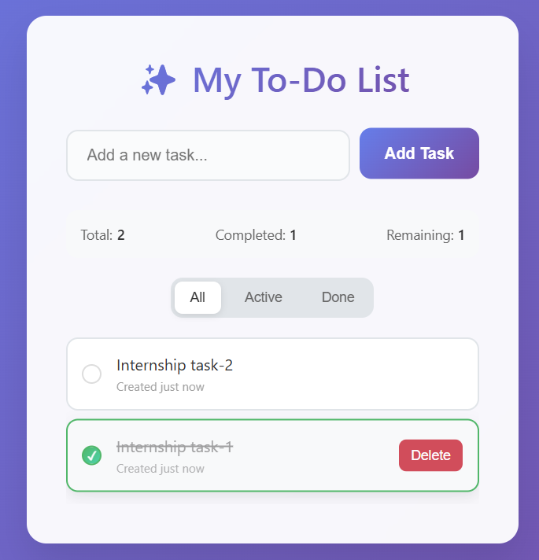

# To-Do List Web App

A dynamic, interactive To-Do list application built with vanilla HTML, CSS, and JavaScript.

## Features Implemented

### Core Requirements ✅

- **Add Tasks**: Input field with "Add Task" button to create new tasks
- **Remove Tasks**: Delete button for each task with smooth animations
- **Mark Complete**: Click checkbox to toggle task completion status
- **Dynamic Updates**: All changes happen instantly without page reload
- **Responsive Design**: Works on desktop and mobile devices

### Enhanced Features 🚀

- **Task Statistics**: Real-time counters for total, completed, and remaining tasks
- **Filtering**: View All, Active, or Completed tasks
- **Priority Detection**: Tasks with urgent keywords get special highlighting
- **Visual Feedback**:
  - Confetti animation when completing tasks
  - Sparkle effects when adding tasks
  - Smooth hover and transition effects
- **Time Tracking**: Shows when each task was created
- **Input Validation**: Prevents empty tasks with visual feedback
- **Keyboard Shortcuts**: Press Enter to add tasks, Ctrl+/ to focus input

## 🔥 Screenshots

### 📝 Full UI with No Tasks

### ➕ Adding a Task

### ✅ Task Marked as Done

### 🟢 Active Task

### 🗑️ Delete Task

