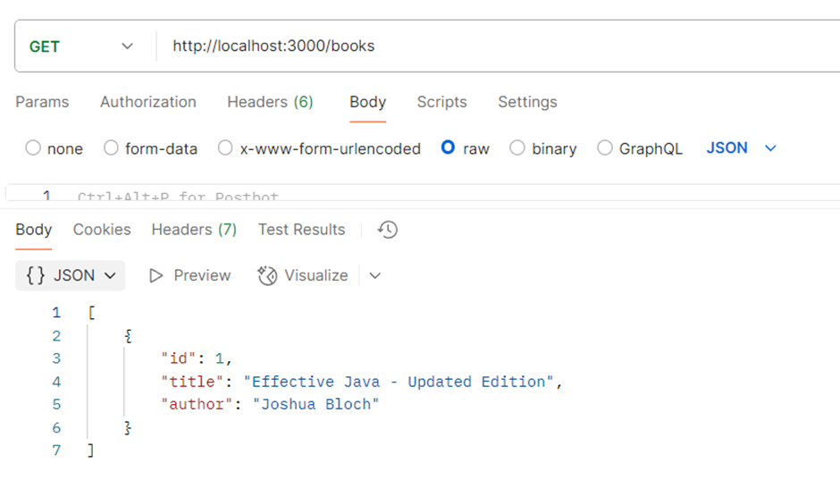
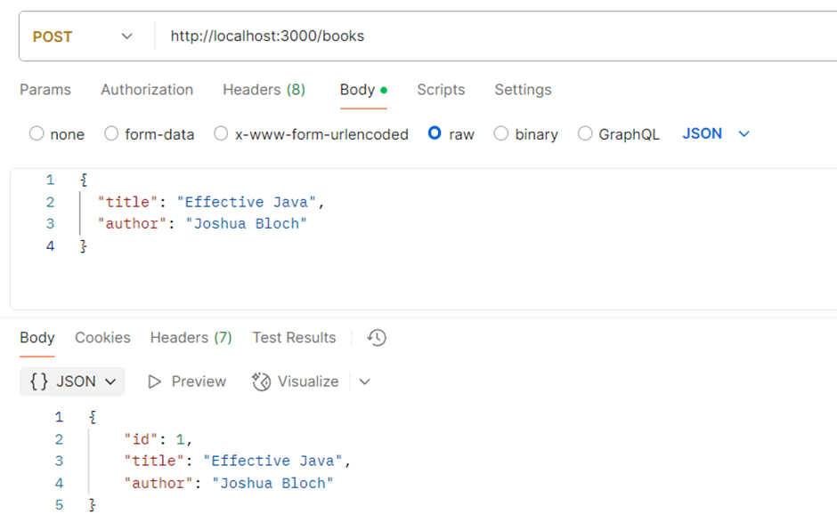
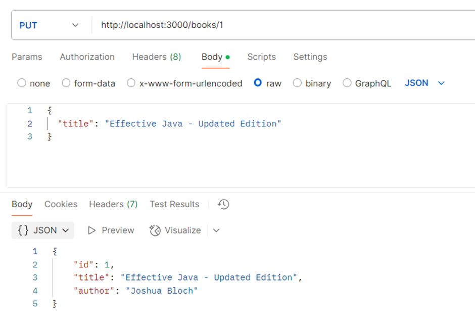
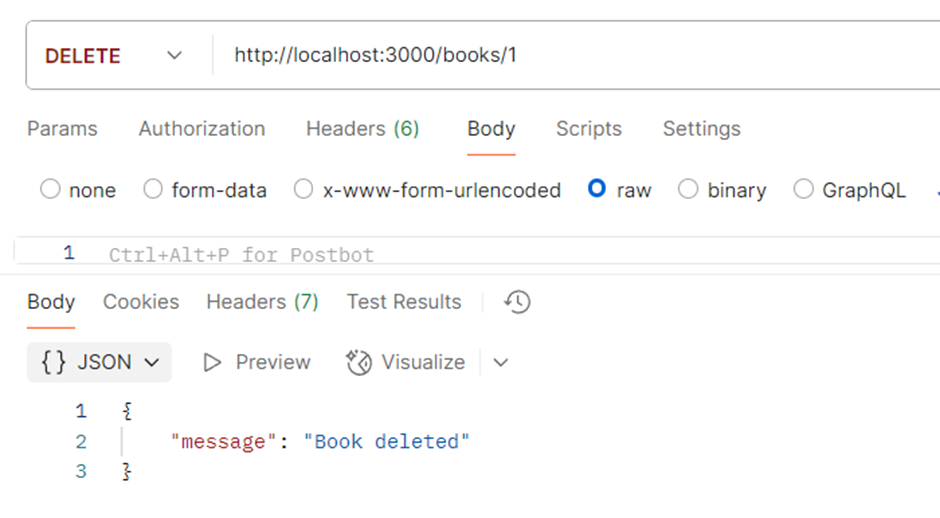

# Books REST API

## Overview

This project is a simple RESTful API built using **Node.js** and **Express** to manage a list of books. It supports the basic CRUD operations (Create, Read, Update, Delete) on books stored in memory without using any database. The API allows clients to add, view, update, and delete books via HTTP endpoints.

---

## Features

- **GET /books** - Retrieve the list of all books
- **POST /books** - Add a new book by sending book details (title, author) in the request body
- **PUT /books/\:id** - Update an existing book’s title and author by its unique ID
- **DELETE /books/\:id** - Delete a book by its ID

---

## Technology Stack

- Node.js (JavaScript runtime)
- Express (Minimal web framework for Node.js)

---

## How I implemented the task

1. **Project Initialization:**

   - Initialized the Node.js project using `npm init`.
   - Installed Express using `npm install express`.

2. **Basic Server Setup:**

   - Created an Express server running on port 3000.
   - Added middleware to parse JSON request bodies.

3. **Data Storage:**

   - Used an in-memory array to store book objects with fields: `id`, `title`, and `author`.
   - Managed unique book IDs using a counter variable.

4. **API Endpoints:**

   - `GET /books` returns all books in JSON format.
   - `POST /books` adds a new book with details from the request body.
   - `PUT /books/:id` updates a book's details by ID.
   - `DELETE /books/:id` removes a book by ID.

5. **Error Handling:**

   - Handled cases where a book to update or delete is not found by returning appropriate HTTP status codes and messages.

6. **Testing:**

   - Tested all API endpoints using Postman to ensure correct functionality.

---

## How to Run the Project

1. **Clone the repository** (if applicable) or copy the project files to your local machine.

2. **Install dependencies:**

   ```bash
   npm install
   ```

3. **Start the server with nodemon (using npm start):**

   ```bash
   npm start
   ```

   This runs the command `nodemon index.js` as defined in the `package.json` scripts, which automatically restarts the server whenever you make changes to the code.

4. **Alternatively**, if you prefer to run nodemon globally without npm scripts, you can install nodemon globally and run:

   ```bash
   npm install -g nodemon
   nodemon index.js
   ```

5. **The API will be running at:**

   ```
   http://localhost:3000
   ```

---

## How to Test the API Endpoints

Use a tool like **Postman** to test.

- **Get all books:**

  ```
  GET http://localhost:3000/books
  ```

- **Add a new book:**

  ```
  POST http://localhost:3000/books
  Body (JSON):
  {
    "title": "Effective Java",
    "author": "Joshua Bloch"
  }
  ```

- **Update a book by ID:**

  ```
  PUT http://localhost:3000/books/1
  Body (JSON):
  {
    "title": "Effective Java - Updated Edition",
    "author": "Joshua Bloch"
  }
  ```

- **Delete a book by ID:**

  ```
  DELETE http://localhost:3000/books/1
  ```

---

## Sample Postman Outputs

### GET /books



### POST /books



### PUT /books/:id



### DELETE /books/:id



---

## Notes

- This API stores books in memory, so all data will be lost when the server restarts.
- No database is used as per the project requirement.
- The API demonstrates basic CRUD operations and REST principles suitable for beginner-level projects.

---
