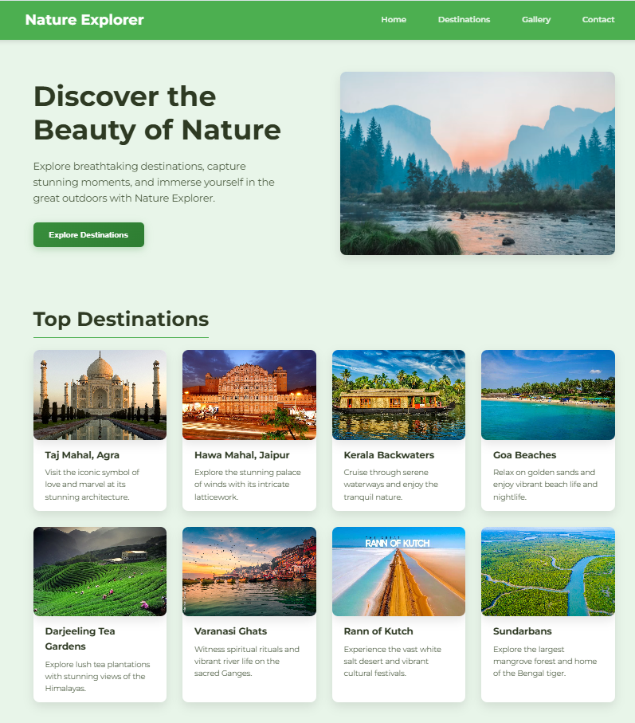
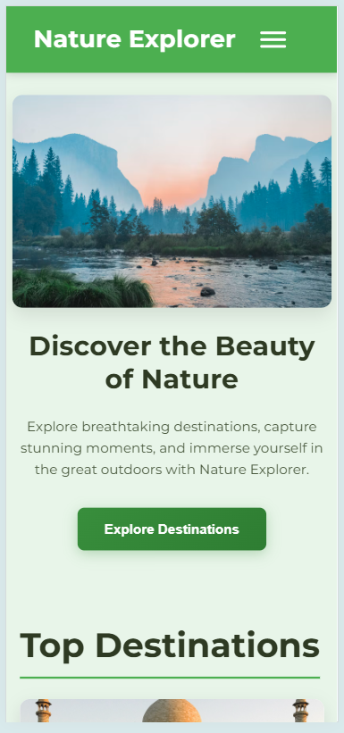
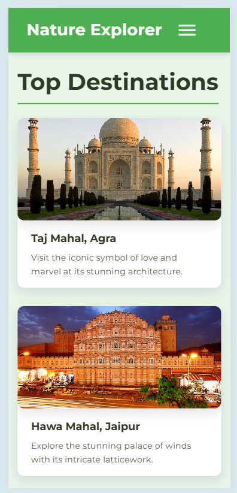

# Nature Explorer – Responsive Web Project 🌿

## 📄 Project Overview

Nature Explorer is a visually rich, HTML and CSS-based travel webpage that showcases top Indian nature destinations and a stunning photo gallery. It features a clean layout with sections like Hero, Destinations, Gallery, and Contact.

## 🎯 Objective

The goal of this update was to **make the website mobile-friendly** by applying responsive design principles using **CSS media queries**.

---

## 🛠️ What Was Updated

### ✅ Media Queries Added

- Targeted `max-width: 768px` for tablets and phones.
- Adjusted layout from side-by-side (flex/grid) to stacked vertically.
- Resized headings, paragraph text, and form fields for small screens.
- Scaled images responsively to fit containers.
- Enabled toggle navigation menu for smaller screens.

### 🧭 Navigation Improvements

- Navigation links now collapse into a hamburger menu.
- JavaScript toggles class for responsive nav visibility.

### 📷 Image Scaling

- Destination and gallery images now scale and wrap correctly on small screens.
- No horizontal scrolling issues.

### 🧪 Tested Using

- **Chrome DevTools device toolbar**
- Devices like iPhone X, iPad, Galaxy Fold

---

## 📌 Final Result

The website now provides a smooth browsing experience across desktop, tablet, and mobile devices. Users can view content without zooming or horizontal scrolling.

---

## 💡 Tools Used

- VS Code
- HTML5, CSS3
- Chrome DevTools

---

## 🔥 Screenshots

<table>
  <tr>
    <td></td>
    <td></td>
  </tr>
</table>
