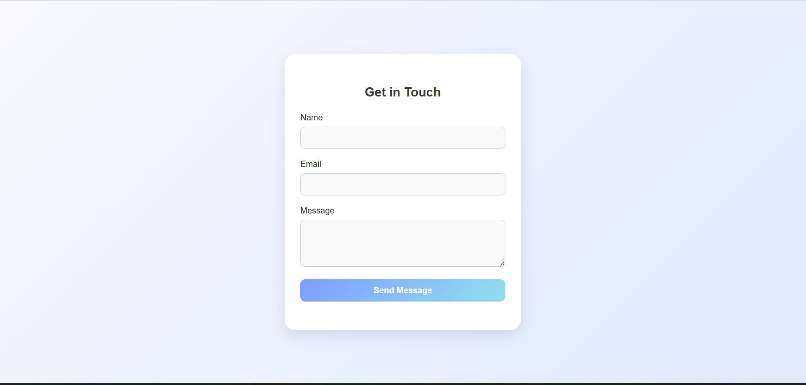
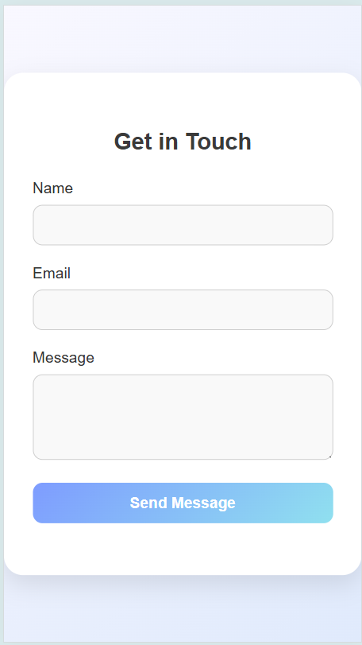
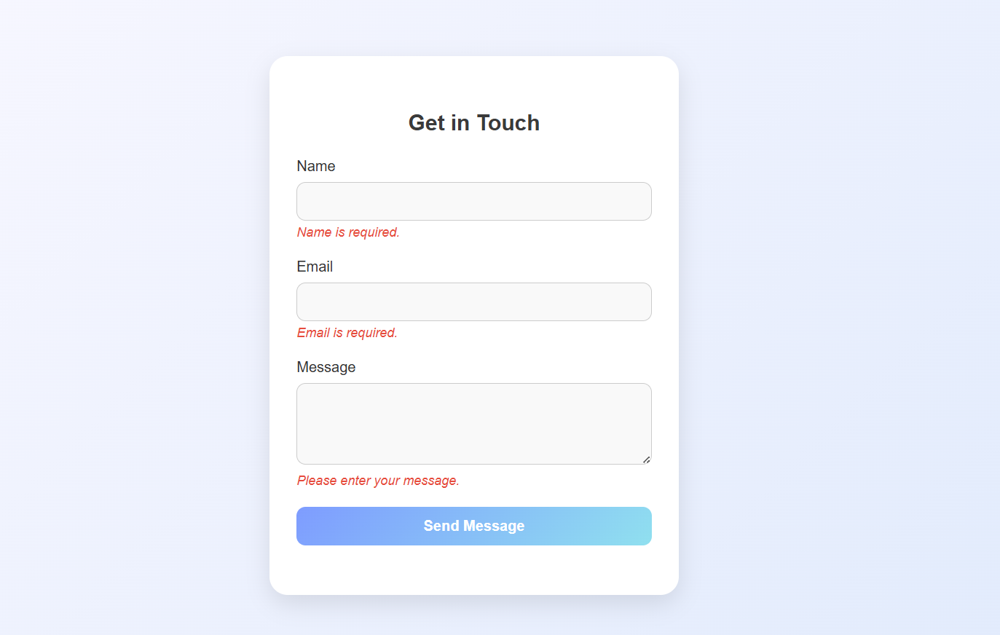
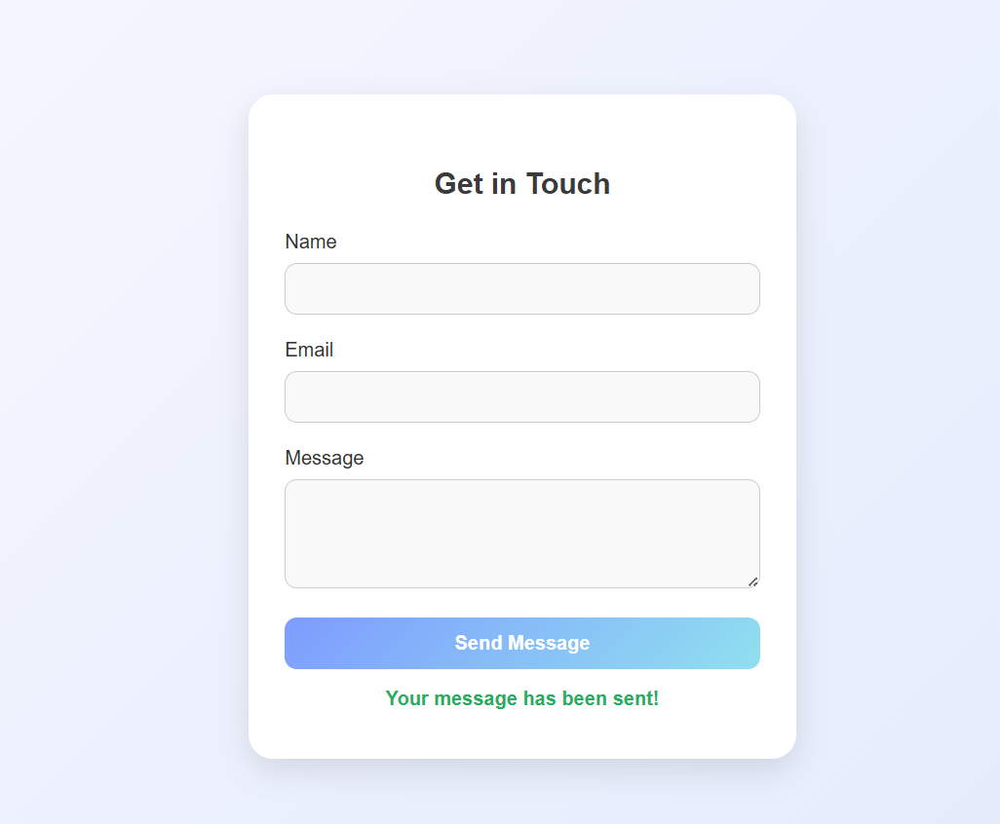

# ✉️ Task 6 – Contact Form with Input Validation

A simple contact form built using **HTML**, **CSS**, and **JavaScript** that performs real-time input validation on the client side.

---

## 📌 Objective

To create a contact form that looks modern and clean — and also ensures that users don’t submit empty or invalid information.

---

## ✅ How I Did It

### 🧱 1. HTML Structure

- I created a form with three main fields:

  - **Name**
  - **Email**
  - **Message**

- Below each input, I added `<div>`s to show real-time validation errors.
- There's also a success message that appears when the form is submitted correctly.

---

### 🎨 2. Styling with CSS

- I used **Flexbox** to center the form vertically and horizontally.
- Added a smooth gradient background for a soft and professional feel.
- Form has:

  - **Rounded corners**
  - **Box shadows**
  - **Responsive layout**

- Input fields change border color on focus to improve accessibility and user feedback.

---

### 🧠 3. JavaScript Validation Logic

- I added a submit listener using `addEventListener`.
- Validations I implemented:

  - **Name**: cannot be empty
  - **Email**: must match a valid format (checked using a regex)
  - **Message**: cannot be empty

- If anything is wrong, I display an inline error.
- On success:

  - Display a green confirmation message ✅
  - Reset the form using `form.reset()`

---

### 🧪 4. Testing (What I tried)

- Tried submitting with:

  - All empty fields 🚫
  - Only email invalid ❌
  - All valid ✅

- Verified that:

  - Error messages show/hide properly
  - Success message appears only when everything is correct

---

## 💻 JavaScript Logic

### 🔁 Form Submit Listener

```js
form.addEventListener("submit", function (e) {
  e.preventDefault();
});
```

- I stop the page from refreshing on submit using `preventDefault()` so I can validate the inputs first.

---

### 🧹 Clear Previous Messages

```js
nameError.innerText = "";
emailError.innerText = "";
messageError.innerText = "";
successMessage.innerText = "";
```

- I always clear old errors and messages before checking again. Clean UI is important!

---

### ✍️ Grab Input Values

```js
const name = nameInput.value.trim();
```

- `.trim()` removes unwanted spaces — just a neat practice so users can’t submit blank spaces.

---

### 🚩 Validation Flag

```js
let isValid = true;
```

- I use a flag to track if all inputs are okay. If any field fails, I set `isValid = false`.

---

### 📛 Name Validation

```js
if (name === "") {
  nameError.innerText = "Name is required.";
  isValid = false;
}
```

- Simple and to the point — empty name = error.

---

### 📧 Email Validation

```js
const emailRegex = /^[^\s@]+@[^\s@]+\.[^\s@]+$/;
```

- I use this pattern to make sure the email format looks like `someone@example.com`.

```js
if (email === "") {
  emailError.innerText = "Email is required.";
  isValid = false;
} else if (!emailRegex.test(email)) {
  emailError.innerText = "Enter a valid email address.";
  isValid = false;
}
```

---

### 💬 Message Check

```js
if (message === "") {
  messageError.innerText = "Please enter your message.";
  isValid = false;
}
```

- Just checking it’s not blank — users must say something!

---

### 🎉 On Success

```js
if (isValid) {
  successMessage.innerText = "Your message has been sent!";
  form.reset();
}
```

- If all fields pass, I show the success message and reset the form. Smooth experience!

---

## 💡 What I Learned

- How to use **form validation** without needing external libraries.
- Regex is super useful but needs practice.
- UI/UX is not just about design — even small feedback like error messages make a huge difference.
- Writing clear and clean code makes debugging easier.

---

## 🖼️ Screenshots

### 📌 Final Contact Form UI

| Desktop View                                          | Mobile View                                         |
| ----------------------------------------------------- | --------------------------------------------------- |
|  |  |

---

### 📩 Error Messages in Action



---

### ✅ Successful Submission



---
