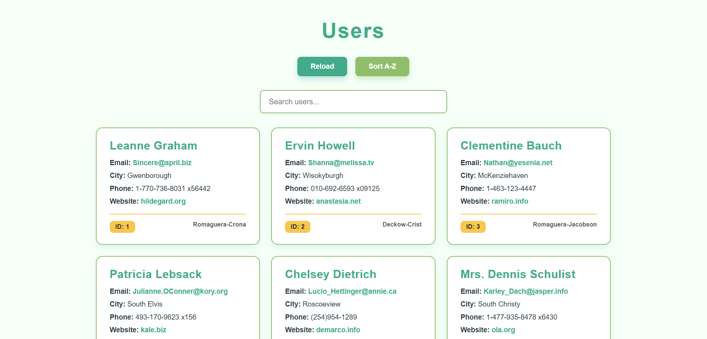
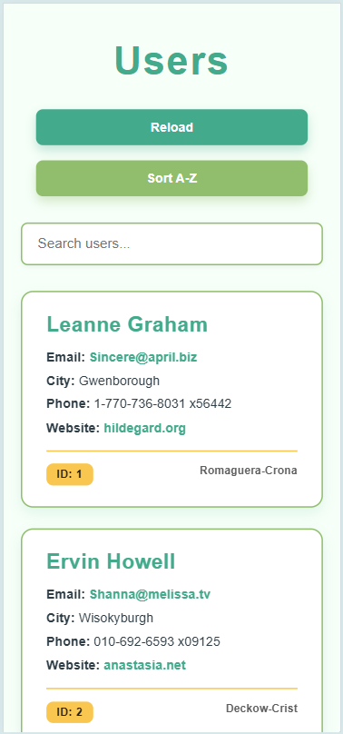

# 🌐 Task 7 – Fetch and Display Data from a Public API Using Fetch API

A simple webpage built with **HTML**, **CSS**, and **JavaScript** that fetches user data from a public API using the **Fetch API** and displays it in a clean and readable format.

---

## 📌 Objective

To practice using the JavaScript **Fetch API** by:

- Fetching user data from a public API endpoint
- Parsing and displaying relevant user information on the webpage
- Handling network errors gracefully
- Allowing users to reload the data on demand

---

## ✅ How I Did It

### 🧱 1. HTML Structure

- Created a container `<div>` to hold the user cards.
- Added a **Reload** button to fetch the data again when clicked.
- Added a simple heading for clarity.

---

### 🎨 2. Styling with CSS

- Designed user cards with:

  - Clear separation and spacing
  - Rounded corners and subtle shadows
  - Consistent font styles for name, email, and address

- Styled the reload button with hover effects and smooth transitions
- Responsive design to ensure readability on mobile devices

---

### 🧠 3. JavaScript Fetch Logic

- Used `fetch()` to request user data from `https://jsonplaceholder.typicode.com/users`.
- Parsed the JSON response to extract user info.
- Looped through the users to dynamically create and insert user cards displaying:
  - Name
  - Email
  - Address (street, city, zipcode)
- Added a **catch** block to handle any errors and display a friendly error message.
- Added a reload button listener to fetch the data again on demand.
- Included a loading indicator during data fetch.

---

### 🧪 4. Testing (What I tried)

- Loading users on initial page load and on reload button click.
- Disabling internet connection to test error handling and error message display.
- Checking data display on desktop and mobile screen sizes.

---

## 💻 JavaScript Logic

### 🔁 Fetch Data

```js
function fetchUsers() {
  usersContainer.innerHTML = "<p>Loading users...</p>";
  fetch("https://jsonplaceholder.typicode.com/users")
    .then((response) => response.json())
    .then((users) => displayUsers(users))
    .catch((error) => {
      usersContainer.innerHTML =
        "<p>Failed to load users. Please try again.</p>";
      console.error("Fetch error:", error);
    });
}
```

---

### 🖼️ Display Users

```js
function displayUsers(users) {
  usersContainer.innerHTML = "";
  users.forEach((user) => {
    const userCard = document.createElement("div");
    userCard.classList.add("user-card");
    userCard.innerHTML = `
      <h3>${user.name}</h3>
      <p><strong>Email:</strong> ${user.email}</p>
      <p><strong>Address:</strong> ${user.address.street}, ${user.address.city}, ${user.address.zipcode}</p>
    `;
    usersContainer.appendChild(userCard);
  });
}
```

---

### 🔄 Reload Button

```js
reloadBtn.addEventListener("click", fetchUsers);
```

- Calls `fetchUsers` again to refresh the data.

---

## 💡 What I Learned

- How to use **Fetch API** to asynchronously retrieve and handle JSON data.
- How to dynamically create and insert HTML elements using JavaScript.
- Basic error handling using `.catch` in promises.
- The importance of user feedback during loading and errors.
- Styling dynamic content with CSS for a good user experience.

---

## 🖼️ Screenshots

### 📌 Users List UI

| Desktop View                                   | Mobile View                                  |
| ---------------------------------------------- | -------------------------------------------- |
|  |  |

---

### 🚫 Error Message on Network Failure & Loading


